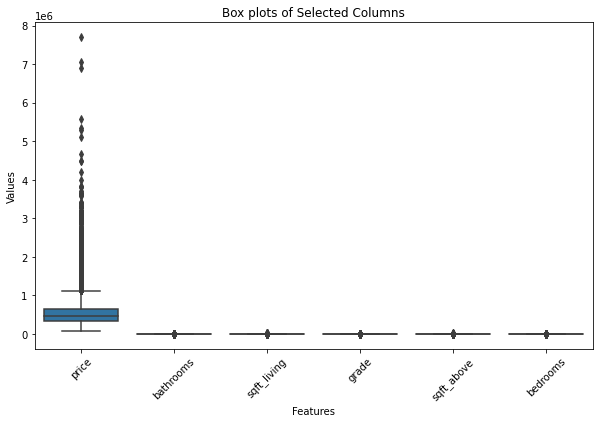
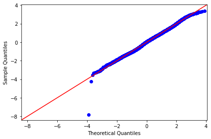

# **Final Project Submission**

**Students names:** 
 - BRIAN KARIUKI
 - ISAAC WANG'ANG'A
 - FAITH MUTISYA
 - PAMELA CHEBII
 - JENIFFER GATHARIA

Student pace: part time

Scheduled project review date/time: 19/07/2024

Instructor name: SAMUEL G MWANGI, SAMUEL KARU AMD WINNIE ANYOSO

# **House Sale Analysis & Regression Model For King County**
## **Business Understanding**
### Introduction
 In the vibrant housing market of King County, understanding the factors that influence home prices is essential for real estate professionals, homeowners, and potential buyers. As the region continues to grow and evolve, stakeholders must analyze the dynamics of the housing landscape to make informed decisions. 
 
 This project aims to analyze the King County House Sales dataset to uncover key determinants of housing prices. For this project, we will use both linear and multi-linear regression modeling to analyze house sales in King County, a northwestern county in Washington State
### Business Problem
A real estate agency is having a challenge providing insight to homeowners regarding house pricing and home renovations. This is after the customer query department noted an influx in the number of queries pertaining to the the pricing and price impact after renovations. The agency needs to develop a predictive model that can accurately estimate the impact of various renovation projects on a home's market value within the region.

The goal is to offer data-driven recommendations to homeowners, enabling them to make informed decisions about which renovations to undertake and how these renovations will affect the resale value of their homes.

This project aims to address the following key objectives:

1. **Analyze the Impact of Square Footage on Housing Prices:** Use simple linear regression to evaluate how sqft_living and sqft_above individually impact house prices in King County. This will quantify the relationship between square footage and property values, providing clear insights for homeowners and real estate investors.

2. **Identify Key Determinants of Housing Prices:** Utilize multiple linear regression modeling to analyze the King County House Sales dataset and determine the primary factors that influence housing prices.

3. **Develop Predictive Model for House Pricing:** Create and refine a predictive model using multiple linear regression to accurately estimate house prices based on the identified key features. This model will assist real estate professionals and homeowners in making informed pricing and investment decisions, enhancing the efficiency and effectiveness of the home buying and selling process.

## **Data Understanding**
This project employs the King County House Sales dataset, found in the kc_house_data.csv file. The dataset encompasses a range of features related to house sales, including square footage, the number of bedrooms and bathrooms, waterfront presence, view quality, year built, and renovation status. It also includes the sale price of each property, which we use as the dependent variable in our regression analysis. Detailed descriptions of the columns are available in the column_names.md file. The goal is to use this comprehensive dataset to understand and quantify the effects of various home renovations on property values.

## **Data Description**

- **Number of Rows (Observations):** There are 21597 rows in the DataFrame.
- **Number of Columns (Variables):** There are 21 columns (or variables) in the DataFrame.

### King County Housing Dataset Column Descriptions

1. id - Unique identifier for a house
2.	date - Date when the house was sold
3.	price - Sale price of the house
4.	bedrooms - Number of bedrooms in the house
5.	bathrooms - Number of bathrooms in the house
6.	sqft_living - Square footage of the interior living space
7.	sqft_lot - Square footage of the lot
8.	floors - Number of floors (levels) in the house
9.	waterfront - Indicates whether the house has a view of the waterfront
10.	view - Number of times the house has been viewed
11.	condition - Overall condition of the house
12.	grade - Overall grade of the house based on the King County grading system
13.	sqft_above - Square footage of the house apart from the basement
14.	sqft_basement - Square footage of the basement
15.	yr_built - Year the house was built
16.	yr_renovated - Year the house was renovated
17.	zipcode - ZIP code of the house's location
18.	lat - Latitude coordinate of the house
19.	long - Longitude coordinate of the house
20.	sqft_living15 - Square footage of interior living space for the nearest 15 neighbors
21.	sqft_lot15 - Square footage of the land lots of the nearest 15 neighbors

### Limitations of the Data

Missing Values: Some columns contain missing values (waterfront, view and  yr_renovated), which could impact the completeness and reliability of our findings.

Omitted Variables: The dataset might lack certain relevant variables, potentially affecting the thoroughness of our analysis.

Accuracy Concerns: There may be accuracy issues within the data, as the specifics of the data collection processes are not disclosed, potentially affecting the validity of the analysis.

Key Columns Description

- Price: The average price of the houses is approximately $540,297, with a standard deviation of $367,368. The prices range from $78,000 to $7,700,000.

- Bathrooms: On average, houses have around 2.12 bathrooms, with a standard deviation of 0.77. The minimum number of bathrooms is 0.5, and the maximum is 8.

- Square Foot Living (sqft_living): The average square footage of the living area is 2,080.32 sq ft, with a standard deviation of 918.11 sq ft. The living areas range from 370 to 13,540 sq ft.

- Grade: The average grade of houses, which reflects overall quality, is 7.66, with a standard deviation of 1.17. The grades range from 3 to 13.

- Square Foot Above Ground (sqft_above): The average square footage above ground is 1,788.60 sq ft, with a standard deviation of 827.76 sq ft. The range is from 370 to 9,410 sq ft.

- Bedrooms: Houses have an average of 3.37 bedrooms, with a standard deviation of 0.93. The number of bedrooms varies from 1 to 33.

## Data Preparation
The data preparation process involved several critical steps to ensure data quality and relevance for modeling. Initially, the data was inspected for duplicates and missing values. No duplicates were found, and missing values were identified in three columns: waterfront, view, and yr_renovated. Missing values for categorical data (waterfront and view) were filled using the mode, while numerical data (yr_renovated) was filled using the mean. Features were selected based on correlation analysis and domain knowledge. The selected features for modeling included sqft_living, grade, sqft_above, and bathrooms, all of which showed significant positive correlations with the target variable (price) and were practically relevant in real estate valuation. To avoid clutter, pair plots and heatmaps visualization were generated for the selected features, further highlighting their relationships with price and identifying potential multicollinearity issues, particularly between sqft_living and sqft_above.

### Pairplot (Correlation)

Outliers were examined using box plots, revealing their presence across all selected features. And since outliers, especially on the higher end, could skew data distribution and impact model accuracy, we capped them while iterating the models to observe their impact. The comprehensive data preparation ensures that the selected features are relevant and that any data anomalies are addressed, laying a solid foundation for the subsequent modeling process.

#### Box Plots (Outliers)

##### Correlation Heatmap

## Feature Selection

Based on correlation analysis and domain knowledge, we recommnded below features for our model due to their potential impact on the target variable (price) and their practical relevance in real estate valuation.

After analyzing the correlation heatmap, it is evident that the most important features influencing house prices are `bathrooms`, `sqft_living`, `grade`, `sqft_above` and `bedrooms`. This conclusion is based on their strong correlation values with the `price` variable. 

- `bathrooms` (0.53): Indicates a moderate positive correlation, suggesting that houses with more bathrooms tend to have higher prices.
- `sqft_livin`g (0.70): Shows a strong positive correlation, meaning that larger living areas significantly increase house prices.
- `Grade` (0.67): Demonstrates a strong positive correlation, implying that higher quality and better-graded houses are priced higher.
- `sqft_above` (0.61): Reflects a strong positive correlation, indicating that houses with more above-ground living space are more expensive.
- `bedrooms` (0.31): This shows a moderate correlation with price. However, using domain knowledge, it is likely that houses with more bedrooms fetch higher prices in the market.
- `View` (0.39)- It has a moderate correlation with price. However, based on domain knowledge, houses with a good view are likely to fetch hihger prices than those without a view.

These correlation values highlight the significant impact of these features on house prices, guiding homeowners and real estate professionals in their decision-making processes.

### Pairplot

- The pairplot for the selected features is shown above to better understand the relationships between the features and the target variable price The scatter plots in the pairplot show linear relationships between price and the selected features, particularly for sqft_living and grade.

- The Pairplot confirms that features like sqft_living, grade, and sqft_above have a stronger impact on price, while bathrooms and bedrooms show a positive but less pronounced relationship with price.

## **Modelling**

### Model 1

- The R-squared value of 0.493 indicates that approximately 49.3% of the variability in house prices can be explained by the square footage of the living area (sqft_living). This suggests a moderate level of explanatory power of the model.

- The model coefficients show that the intercept (const) is -43,999, which is statistically significant with a t-statistic of -9.975 and a p-value of 0.000. The coefficient for sqft_living is 280.863, also highly significant with a t-statistic of 144.819 and a p-value of 0.000, indicating a strong positive relationship between square footage and house prices.

#### Visualizing the Relationship Between Square Foot Living and Price

- The above visualization shows the actual data estimates of the living area square footage

- We note from the above that the price of the house increases as the living room square footage increases.

The performance metrics for the linear regression model indicate the following:

- Mean Squared Error (MSE): The MSE value of approximately 65.98 billion suggests that the model's predictions, on average, deviate from the actual house prices by a large amount when squared differences are considered. This indicates a significant error magnitude, possibly due to outliers or a wide range of house prices.

- Mean Absolute Error (MAE): The MAE value of approximately 170,983 indicates that, on average, the model's predictions differ from the actual prices by around $170,983. While this provides a clearer picture of prediction accuracy than the MSE, it still points to considerable errors in prediction, which could affect decision-making.

- R Squared (R²): The R² value of approximately 0.493 suggests that the model explains about 49.3% of the variance in house prices based on the predictor variables used. While this indicates a moderate fit, it also means that over 50% of the variance in house prices remains unexplained by the model, highlighting the need for additional features or more complex modeling techniques to improve predictive accuracy.

Overall, these metrics suggest that while the model captures some relationships between the features and house prices, there is substantial room for improvement. The high error values and moderate R² suggest that the model could benefit from additional relevant features, better handling of outliers, or the use of more advanced modeling techniques.

### **Model 2**

- Linearity: The plot shows a more randomly scattered pattern with no clear systematic structure, which suggests that the linearity assumption is better satisfied compared to the previous plot that exhibited a clear pattern.

- Normality: The points in the Q-Q plot closely follow the red line, with slight deviations at the tails. This indicates that the residuals are approximately normally distributed, and the normality assumption is better met than in the previous plot, which showed larger deviation

Model 2 outperforms Model 1 in all the key metrics:

- Mean Squared Error (MSE): Model 2 has a lower MSE (60,197,315,834.50) compared to Model 1 (65,977,373,783.62), indicating that Model 2's predictions are closer to the actual values on average.

- Mean Absolute Error (MAE): Model 2 also shows a lower MAE (158,764.49) than Model 1 (170,982.92), meaning the average absolute error of predictions in Model 2 is smaller, which generally suggests better predictive accuracy.

- R Squared (R²): Model 2 has a higher R² value (0.538) compared to Model 1 (0.493), signifying that Model 2 explains a greater proportion of the variance in the target variable.

Overall, Model 2 is more accurate and provides a better fit to the data compared to Model 1.

## Regression Results

### Conclusion
The analysis of the King County House Sales dataset using both simple and multiple linear regression models reveals key insights into the factors influencing housing prices. The simple linear regression highlighted the impact of square footage on property values, with sqft_living (a correlation of 0.7) showing a strong correlation with house prices. 

The multiple linear regression model further refined these insights by identifying additional significant determinants such as the number of bathrooms, sqft_living, grade, sqft_above and bedrooms. These findings provide a robust foundation for understanding how different features contribute to the overall market value of homes.

# Recommendations

1. **Homeowners should invest in increasing living  area space:**
Homeowners in King County should consider expanding their living areas, as the analysis shows the highest positive correlation with the housing price. For homeowners, this investment can significantly increase the property value.

2. **Homeowners should consider key features like housing grade, number of bathrooms, and square footage above when renovating:**
Homeowners in King County should prioritize improvements in key determinants like housing grade, number of bathrooms, and square footage above ground to maximize property value and attract higher prices.

3. **Utilize Predictive Modeling for Pricing Strategies:**
Real estate agents and homeowners should use the predictive model to evaluate renovation projects before committing resources. By inputting different renovation scenarios into the model, stakeholders can forecast the potential return on investment (ROI) and prioritize projects that offer the highest value increase.