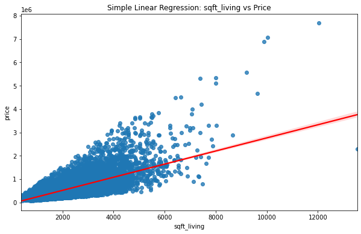
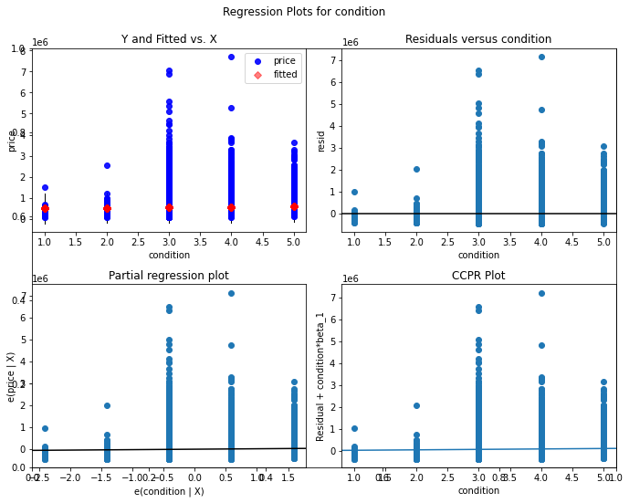
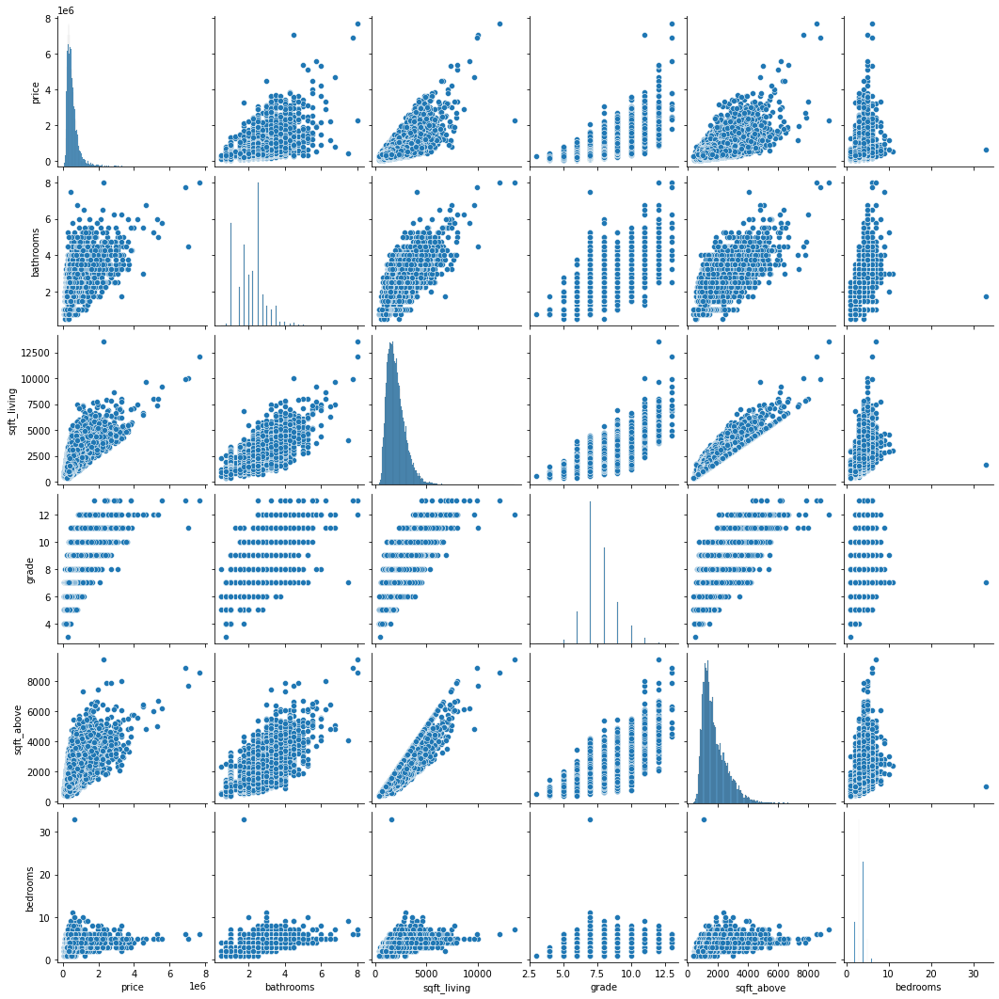

# House Sale Analysis & Regression Model For King County
## Project Review
### Business Problem
#### Compass homeowners real estate agency is having a challenge providing insight to homeowners regarding house pricing and home renovations. This is after the customer query department noted an influx in the number of queries pertaining to the the pricing and price impact after renovations. The agency needs to develop a predictive model that can accurately estimate the impact of various renovation projects on a home's market value within the region.

#### The goal is to offer data-driven recommendations to homeowners, enabling them to make informed decisions about which renovations to undertake and how these renovations will affect the resale value of their homes.

#### The questions to be answered are:

#### 1. What is the most significant factor that influences the house pricing in the region? 
#### 2. What other features when put into consideration could improve the pricing and yield higher returns? 
#### 3. How much can a homeowner expect the value of their home to increase after a specific renovation project?
### Data Understanding
#### The King County House Sales dataset is used for this analysis. The file contains information on over 21,000 housing units. The data is organized into a dataframe with several columns containing information on the housing units. See the columns contained in the dataset along with their descriptions:

* **id** - Unique identifier for a house
* **date** - Date house was sold
* **price** - Sale price (prediction target)
* **bedrooms** - Number of bedrooms
* **bathrooms** - Number of bathrooms
* **sqft_living** - Square footage of living space in the home
* **sqft_lot** - Square footage of the lot
* **floors** - Number of floors (levels) in house
* **waterfront** - Whether the house is on a waterfront Includes Duwamish, Elliott Bay, Puget Sound, Lake Union, Ship Canal, Lake Washington, Lake Sammamish, other lake, and river/slough waterfronts
* **view** - Quality of view from house Includes views of Mt. Rainier, Olympics, Cascades, Territorial, Seattle Skyline, Puget Sound, Lake Washington, Lake Sammamish, small lake / river / creek, and other
* **condition** - How good the overall condition of the house is. Related to maintenance of house. See the King County Assessor Website for further explanation of each condition code
* **grade** - Overall grade of the house. Related to the construction and design of the house. See the King County Assessor Website for further explanation of each building grade code
* **sqft_above** - Square footage of house apart from basement
* **sqft_basement** - Square footage of the basement
* **yr_built** - Year when house was built
* **yr_renovated** - Year when house was renovated
* **zipcode** - ZIP Code used by the United States Postal Service
* **lat** - Latitude coordinate
* **long** - Longitude coordinate
* **sqft_living15** - The square footage of interior housing living space for the nearest 15 neighbors
* **sqft_lot15** - The square footage of the land lots of the nearest 15 neighbors
### Data Understanding
#### This project uses the King County House Sales dataset, found in kc_house_data.csv. The file contains information on over 21,000 housing units. The data is organized into a data frame with several columns containing information on the housing units. The columns we used in the analysis are:

* **price** - Sale price (prediction target) Predictor Variable
* **condition** - How good the overall condition of the house is. Related to the maintenance of the house.
* **bedrooms** - Number of bedrooms
* **bathrooms** - Number of bathrooms
* **sqft_living** - Square footage of living space in the home
* **floors** - Number of floors (levels) in house
### Getting Started
#### Upon carefully choosing, analyzing, cleansing, and generating descriptive statistics, we developed several visualizations that elaborately showed the correlation of each feature in relation to price. These visual representations stem from the selection of relevant columns in our dataset and offered valuable insights for the project.
### Visualization

#### From the above scatter plot, we observe that sqft_living has a continuous positive correlation with price.
### Modeling
#### Baseline Model: Simple Linear Regression

#### Since sqft_living was the feature with the strongest correlation, we built a simple linear regression with that. We built a simple linear regression model (Model: OLS) with 'sqft_living' as the only independent variable. From our model, for each additional square foot of living space, the 'price' is expected to increase by  258,500 units when all other factors remain constant.
### Simple Linear Regression Visualization

#### Partial Regression Plot / Plotting Residuals

* The image shows a plot of the regression with the "sqft_living" as the exogenous variable
* Plot 1: The dependent variable vs. sqft_living with the regression line.
* Plot 2: Residuals vs. sqft_living to check for homoscedasticity (constant variance of residuals).
* Plot 3: Partial regression plot to show the relationship between price and sqft_living while accounting for other variables.
* Plot 4: The leverage plot to detect influential data points.
* Plot 5: The Q-Q plot to check the normality of residuals.
#### Regression Diagnostic For The Multiple Regression
##### Since we have a model with 1 predictor (sqft_living) as well as a model with 2 predictors we tried a model that uses all of the available numeric columns as features. The model was a multiple linear regression model (Model: OLS) with eight independent variables. So, the multiple linear regression equation based on this output is:
##### The below model represents the relationship between the 'price' of a house and multiple independent variables, including square footage of living space ('sqft_living'), the number of bathrooms ('bathrooms'), the number of bedrooms ('bedrooms'), the number of floors ('floors'), and four categorical variables representing different conditions ('condition_Fair', 'condition_Good', 'condition_Poor', 'condition_Very Good'). Each coefficient represents the change in the 'price' associated with a one-unit change in the respective independent variable, holding all other variables constant.
[text](.MD)          
* The plots show the regression with the different independent variables as highlighted on the title.
* The Q-Q plots are also used to visualize the normality of the variables - we note that sqft_living performs better in terms of normality test than the other variables.
### Conclusion
#### Based on the provided interpretation of the three model results and the business problem faced by the real estate agency, we can draw the following conclusions

#### Baseline Model: The baseline model, which includes only the 'sqft_living' variable, has an RMSE of approximately 261,655 USD and an R² of 0.4927. While it provides a basic estimate of home prices, it has room for improvement in both prediction accuracy and explanatory power.

#### The second Model: This model includes all chosen independent variables, performs the best among the models. It has the lowest RMSE (approximately 255203.69 USD) and the highest R² (0.5174). This model demonstrates the highest prediction accuracy.

#### The best model chose out of the two is the second model because of:

### Model Performance:
#### The second model, which incorporates 'condition,' 'bedrooms,' 'bathrooms,' 'sqft_living,' and 'floors,' exhibits the best overall performance among the models considered.

### Prediction Accuracy:
#### The second model has the lowest Root Mean Absolute Error (MAE) of approximately 168621.5 USD, indicating the highest prediction accuracy among the models. This means that the model's predictions are, on average, the closest to the actual sale prices.

### Explanatory Power:
#### The second model also has the highest R-squared (R²) value of approximately 0.5174, signifying the greatest explanatory power. It explains about 51.74% of the variance in home prices, suggesting that it provides the most comprehensive understanding of the factors influencing sale values.

#### The model built offers a valuable tool for the agency to formulate effective pricing strategies. It provides coefficients associated with each feature, allowing the agency to make more precise price estimates based on a property's specific attributes. Additionally, by comparing these estimated prices to real-world prices, the agency can spot instances where properties are priced too high or too low, enabling them to make appropriate adjustments to optimize their sales potential.

### Recommendations
#### Based on the the business questions and objectives of the project and the second model, which includes 'condition,' 'bedrooms,' 'bathrooms,' 'sqft_living,' and 'floors,' the following are detailed recommendations for the real estate agency Amani:

#### Estimating the Impact of Specific Renovation Projects: The agency can use the second model to provide homeowners with estimates of how specific renovation projects will impact the resale value of their homes. This will assist homeowners in estimating the impact of specific renovations, create a user-friendly interface or tool where homeowners can input details about their renovation plans, such as the number of bedrooms, bathrooms, the condition of the property, square footage of living space, and the number of floors. The model can then generate predictions of the expected increase in home value after these renovations. Homeowners can make informed decisions about which renovation projects to prioritize, based on their expected return on investment (ROI). This will empower homeowners to invest in renovations that will maximize their property's resale value.

#### Identifying Renovation Projects with the Most Impact: The agency can utilize the second model to identify which specific renovation projects or features have the most significant impact on a home's market value in the northwestern county. They can conduct a feature importance analysis using the second model. This analysis can highlight which variables (e.g., bedrooms, bathrooms, condition) have the most substantial influence on home prices. The model can then provide rankings or insights into which renovations or property features contribute the most to home value. By identifying the most impactful renovation projects and features, the agency can guide homeowners toward investments that are likely to yield the highest returns. This can also inform marketing strategies and property listings for sellers.

#### Correlation of Bedrooms, Bathrooms, Grade, and Square Footage with Sale Price: They can leverage the second model to explain how the number of bedrooms, bathrooms, the grade of a house, and its square footage correlate with its sale price in King County. They can utilize the model's coefficients and feature importance analysis to explain the correlations between these variables and sale price. This will provide homeowners and buyers with insights into how each of these factors influences home prices, allowing them to make more informed decisions. Homeowners can understand which property features are highly valued in the real estate market, potentially guiding them in making renovations or improvements that align with market preferences. Buyers can use this information to assess property values based on their preferences and requirements.

#### Identifying Combinations of Renovation Projects: The second model will help identify specific combinations of renovation projects that provide an interdependent effect on a home's market value. They can use the model to analyze the effects of combining different renovation projects. Identify combinations that result in combined effects on home values. This will provide homeowners with recommendations on the combinations of renovations that may maximize their property's resale value.

#### These recommendations align with the agency's goal of offering comprehensive guidance and enhancing decision-making for clients in the real estate market.

### Summary
#### In summary, the project study suggests that the number of bedrooms, square footage of living area, condition, number of bedrooms, bathrooms and floors are important factors to consider when determining the price of a home. However, it is essential to consider other market factors and property-specific attributes in conjunction with the findings of this analysis to arrive at an accurate and competitive listing price such as architectural style, lot size and landscaping, upgrades and amenities, historical sales data, market trends, school district, crime rate, zoning and regulations.

